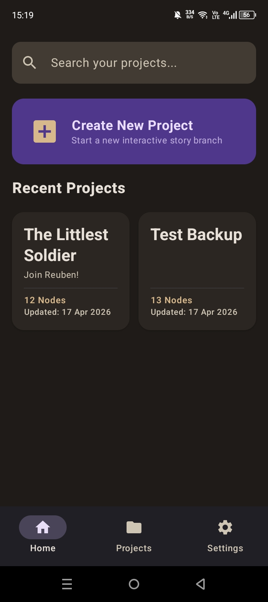
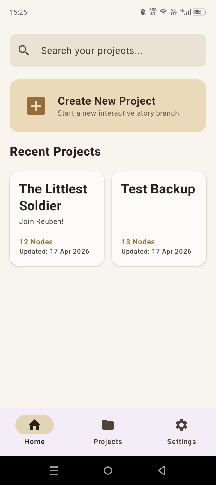
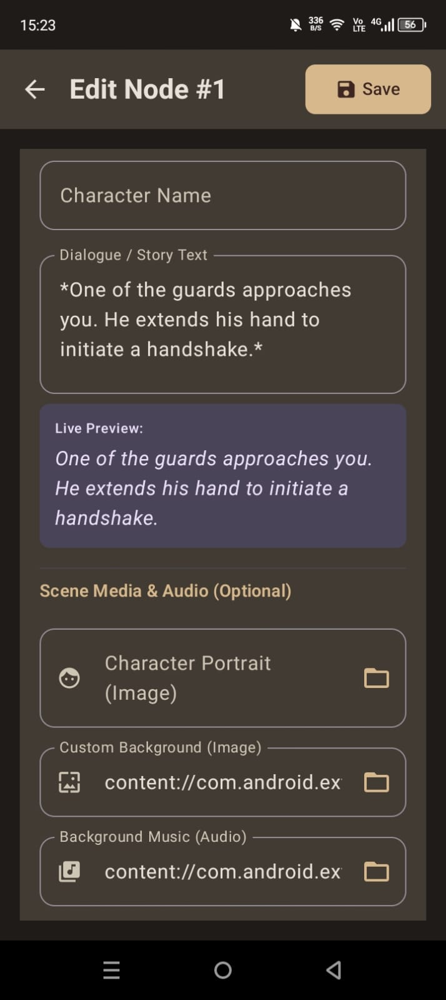
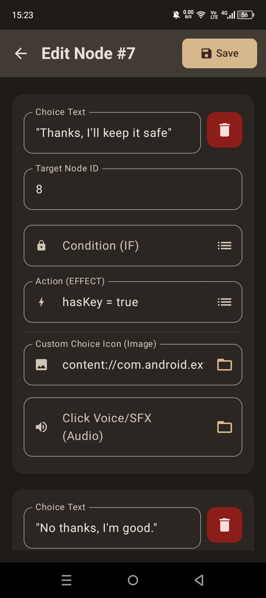
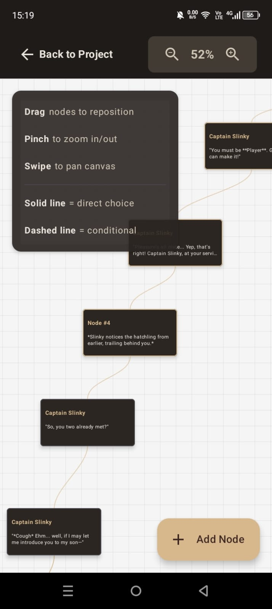
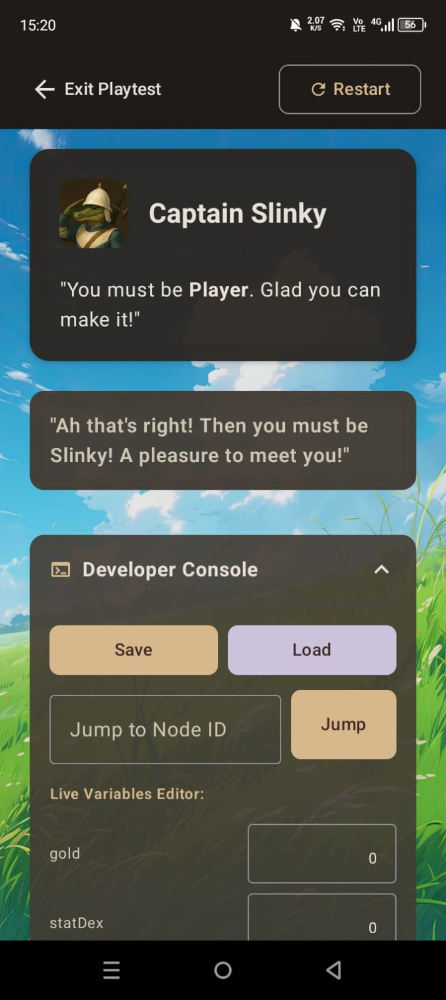
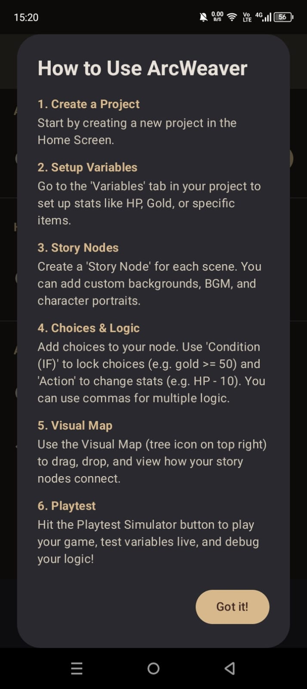

# ArcWeaver 📖✨

**ArcWeaver** is a native Android application designed to empower storytellers, game designers, and writers to create, map, and playtest complex interactive branching narratives directly from their mobile devices.

Built with modern Android development standards, ArcWeaver utilizes a robust **Clean Architecture (MVVM)**, **Jetpack Compose** for a declarative UI, and an independent **Domain Logic Engine** to process complex variable evaluations.

---

## 📸 Screenshots

<p align="center">
  
  
  
  
  
  
  
</p>

---

## 🚀 Key Features

### 1. 🗺️ Visual Story Map (Graph Rendering)
Write without losing context. ArcWeaver renders your branching storyline into a 2D interactive canvas.
* Drag-and-drop nodes to organize your narrative spatially.
* Real-time spatial persistence using Room Database & StateFlow.

### 2. 🧠 Dynamic Playtest Engine
Simulate your interactive story exactly as a reader would experience it.
* **Conditional Logic:** Lock or unlock narrative choices based on player stats (e.g., `gold >= 50`).
* **Variable Mutation:** Actions seamlessly modify global variables (e.g., `hp - 10`) during runtime.
* **Developer Console:** Monitor live variables and jump between nodes during playtesting.
* **Save/Load State:** Real-time auto-saving prevents data loss during simulations.

### 3. 💾 Robust Portability (JSON Export/Import)
Easily backup or share your complex storyline.
* **Two-Pass ID Mapping Algorithm:** Ensures that when you import a project to a new device, relational Foreign Keys between nodes and choices are perfectly reconstructed without breaking the graph.
* **Scoped Storage:** Securely handles persistent URIs for external Background Images and BGM (Background Music).

---

## 🛠️ Tech Stack & Architecture

This project is built strictly following **Clean Architecture** principles and the **MVVM** pattern to separate concerns and ensure maintainability.

* **Language:** [Kotlin](https://kotlinlang.org/) (100%)
* **UI Toolkit:** [Jetpack Compose](https://developer.android.com/jetpack/compose) (Declarative UI, Material Design 3)
* **Local Database:** [Room Database](https://developer.android.com/training/data-storage/room) (SQLite) with heavily optimized relational mapping (Foreign Keys & Cascade Deletion).
* **Asynchronous Programming:** [Coroutines](https://kotlinlang.org/docs/coroutines-overview.html) & [Flow / StateFlow](https://developer.android.com/kotlin/flow) for reactive data streams.
* **Serialization:** `kotlinx-serialization-json` for project export/import.
* **Media Handling:** Android Storage Access Framework (SAF) with `takePersistableUriPermission`.

---

## 📂 Project Structure (Layered Clean Architecture)

```text
com.storymaker.arcweaver
├── data/           # Repositories (Single Source of Truth), Room DAOs, Entities
├── domain/         # Core Business Logic (PlaytestEngine, Evaluator, Parser)
├── model/          # Pure Data Classes
├── ui/             # Jetpack Compose Screens, Theme, Components
└── viewmodel/      # Presentation Layer handling UI State and User Intents
```
---

## 💻 Getting Started (Installation)

To build and run this project locally:

1. **Clone the repository:**
   ```bash
   git clone [https://github.com/YourUsername/ArcWeaver-Android.git](https://github.com/YourUsername/ArcWeaver-Android.git)
Open in Android Studio:
Open the cloned directory in Android Studio (Koala or newer recommended).

2. **Sync Gradle:**
Allow the IDE to sync the build.gradle.kts dependencies.

3. **Run:**
Deploy to an Android Emulator or a physical device running Android 8.0 (API 26) or higher.

## ✒️ Author
* **Abyan Zhafran - Software Engineering Student / Android Developer**
* **Aditya Ardian Syah - Software Engineering Student / Android Developer**

If you have any questions or feedback regarding the project's architecture, feel free to reach out!